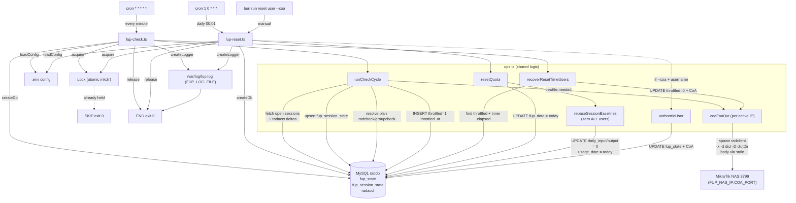

# script-FUP

Daily Fair-Use-Policy (FUP) throttling for FreeRADIUS/MikroTik networks, migrated
from Bash to TypeScript + Bun + Drizzle. Every decision is in one shared
operations module; the two entrypoints are thin wiring.

> **Deploying?** See **[DEPLOY.md](DEPLOY.md)** for the end-to-end guide —
> binary vs source install, `.env` table, cron, migration, verification and
> troubleshooting.

## Architecture

```
src/
  fup.ts            pure bigint-safe math (deltas, quota, rate checks) — no I/O
  ops.ts            shared orchestration — ALL logic lives here exactly once
  coa.ts            radclient CoA via spawn argv (no shell)
  db.ts             Drizzle schema + mysql2 connection
  config.ts         typed, validated .env loader
  logger.ts         timestamped file logger (fire-and-forget)
  lock.ts           atomic mkdir-based filesystem lock
  declare.ts        radius attribute names, defaults, rate regex
  bin/fup-check.ts  minute cron entrypoint
  bin/fup-reset.ts  daily / manual reset entrypoint
```

Both entrypoints only wire config → lock → logger → db, then call shared
helpers from `ops.ts`. They never re-implement attribute resolution, session
delta accounting, rebase, quota reset, or CoA fan-out. This mirrors the Bash
`fup-coa-check.sh` / `fup-coa-reset.sh` behaviour.

### Flowchart



The graph shows the two entrypoints converging on the same `config → lock →
logger → db` wiring, then diverging into the matching subset of `ops.ts`
helpers. Only `fup-reset.ts` ever calls `resetQuota` / `rebaseSessionBaselines`
/ `unthrottleUser`; only `fup-check.ts` ever calls `runCheckCycle` /
`recoverResetTimeUsers`. The shared `Lock` is what guarantees the minute cron
and the daily rollover can never touch the same row at the same time.

## Setup

```bash
bun install
cp .env.example .env
# edit .env to taste, then install the RADIUS attribute below
```

Requirements: [Bun](https://bun.sh) ≥ 1.4, a running FreeRADIUS MySQL database
and a MikroTik router reachable on the CoA port.

### New RADIUS attribute (FUP-Reset-Time)

The migration adds `throttled_at` to `fup_state` so a user can be
**auto-unthrottled** a fixed number of minutes after being throttled.

Set `FUP-Reset-Time` (seconds are not used; the value is whole minutes) per
user or group. When that many minutes pass after a user was throttled, the
minute cron restores their `normal_rate` and clears the throttle automatically.

```
FUP-Reset-Time = 1440   # restore 24h after throttling
```

- `0` / unset → never auto-restores; only the daily reset (or manual) clears it.
- Requires a `normal_rate` (the checked `Mikrotik-Rate-Limit`), else the
  restore is skipped with an `ERROR` log.

## Build (single-file binaries)

`bun run build` compiles both entrypoints into standalone executables via
`bun build --compile` (Bun ≥ 1.1, current is 1.4):

```bash
bun run build
# or one at a time:
bun run scripts/build.mjs check
bun run scripts/build.mjs reset
```

Output — each is a single ELF file containing the Bun runtime, the bundled
JS, and all `node_modules` deps:

```
dist/fup-check    # the minute cron — same behaviour as `bun run check`
dist/fup-reset    # the daily/manual reset — same behaviour as `bun run reset`
dist/*.js.map     # sourcemaps for stack traces
```

No Node/Bun, no `node_modules/` needed on a target server. The binary only
requires the external `radclient` executable and a reachable MySQL/MikroTik
from the machine it runs on, plus the same `.env` (or exported env vars).

## Cron wiring

Stand up the minute and daily entrypoints with the package scripts (or the
single-file binary from `dist/` — same behaviour). If you've deployed via
`bun run build`, point cron at the compiled binary (no `cd` needed):

```cron
# every minute: enforce FUP + auto-restore FUP-Reset-Time users
* * * * * /path/script-FUP/dist/fup-check
# once a day at 00:01: full quota rollover (no CoA)
1 0 * * * /path/script-FUP/dist/fup-reset
```

For source-based runs (requires `bun` on the server):

```cron
* * * * * cd /path/script-FUP && /usr/bin/bun run check
1 0 * * * cd /path/script-FUP && /usr/bin/bun run reset
```

Optional per-user manual + CoA restore:

```bash
bun run reset some-user --coa   # reset this user and CoA-restore
bun run reset                    # reset everyone, no CoA
```

## Entrypoints (why two, not one)

The two entrypoints are **not** merged because they fire on different cadences:

- `fup-check.ts` (minute) — throttles users whose `daily >= quota`, rolls a
  stale `fup_date` (NEW_DAY), and **auto-restores** throttled users whose
  `FUP-Reset-Time` grace has elapsed. This is what makes "reset after
  throttled" dynamic — it runs every minute, so a user is unthrottled
  immediately once their reset timer passes.
- `fup-reset.ts` (daily 00:01) — clears `fup_date`/throttle and rebases
  session baselines for the next day. Rebase zeroes today's usage for **every**
  user — open, closed, and unmatched sessions alike — so the fresh daily quota
  starts from 0 for everyone. With `--coa username` it re-applies the user's
  `normal_rate` (used for manual restore too).

Both share every decision in `ops.ts` and guard each other with the same
filesystem lock, so the minute run and daily rollover can never write
concurrently.

## Database migration

The only schema change over the Bash version is one new column:

```sql
ALTER TABLE fup_state
  ADD COLUMN throttled_at TIMESTAMP NULL DEFAULT NULL AFTER throttled;
-- rollback:
-- ALTER TABLE fup_state DROP COLUMN throttled_at;
```

Run that on your raddb schema before deploying the .ts cronjobs.

> **Note:** the Bash bootstrap inserted a resolved `normal_rate` (never NULL), but the TypeScript bootstrap seeds `NULL` (rate is resolved later, at throttle time). If your live `fup_state.normal_rate` is `NOT NULL` (the Bash-era default), apply the one-time adjustment to allow the seed:
> ```sql
> ALTER TABLE fup_state MODIFY normal_rate VARCHAR(64) NULL DEFAULT NULL;
> ```

## Verbose / debug output

Set `FUP_DEBUG=1` in `.env` (or prefix the command) to echo every timestamped log line to stderr — useful for ad-hoc runs and verifying the minute cron without tailing the log file:

```bash
FUP_DEBUG=1 bun run check
```

In cron you can keep it off (default) and rely on the log file; enable temporarily for diagnosis.

## Testing

Offline (no DB / router needed):

```bash
bun test        # unit tests — pure math, logger, config, rate parsing
bunx tsc --noEmit   # type check
```

Live dry-run against a real DB — echoes every step to stderr but reviews what
it *would* do before letting a real CoA fire:

```bash
FUP_DEBUG=1 bun run check
```

To force a test user over quota and observe a real throttle + auto-restore:

```sql
-- nothing already throttled: push the user past their daily quota
UPDATE fup_session_state
   SET daily_input = daily_input + 500 * 1024 * 1024
 WHERE username = 'testuser';
```

Then run `bun run check` every minute (see FUP-Reset-Time above) and watch the
log for `THROTTLE` → (after `FUP-Reset-Time` minutes) `RESET` restore. To test
the restore without touching the live router first, point `FUP_NAS_IP` at an
unreachable address so the CoA fails on purpose — the throttle will be logged
but nothing on the router changes.

## Deployment checklist

Follow the detailed [DEPLOY.md](DEPLOY.md) guide. Quick version:

1. `bun install` then `bun run build` (Bun ≥ 1.4 required) — or on the target,
   `bun install` only if you'll run from source. (Both are covered in the
   Build section above and in DEPLOY.md §2.)
2. `cp .env.example .env` and fill in DB / NAS credentials.
3. **Apply the migration before deploying the cronjobs** (see the Database
   migration section above and DEPLOY.md §4): `mysql raddb < migration.sql`.
4. Set `Max-Daily-Traffic`, `Mikrotik-Rate-Limit`, `FUP-Rate-Limit` and
   (optional) `FUP-Reset-Time` per user/group in the RADIUS config.
5. Install the two crons from the Cron wiring section (see DEPLOY.md §6) —
   preferably the compiled binaries (`dist/fup-check`, `dist/fup-reset`) so a
   server with no Bun/node_modules can still run them.
6. Tail `/var/log/fup.log` (`FUP_LOG_FILE`) for the first cycle (verification
   steps and expected log lines in DEPLOY.md §7).

## Security notes

- radclient is spawned through an argv array (`spawn`, no shell); the CoA body
  travels over stdin, never concatenated into a shell string.
- Usernames and IPs are validated/redacted before any logging.
- All octet counters use `bigint` end-to-end — no float precision loss.