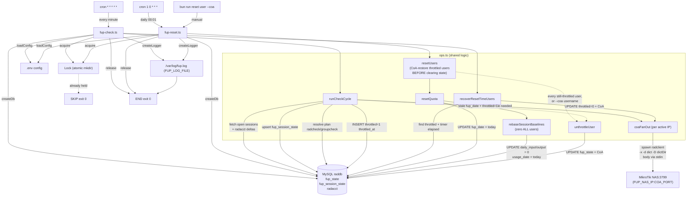

# script-FUP

Daily Fair-Use-Policy (FUP) throttling for FreeRADIUS/MikroTik networks, migrated
from Bash to TypeScript + Bun + Drizzle. Every decision is in one shared
operations module; the two entrypoints are thin wiring.

> **Deploying?** See **[DEPLOY.md](DEPLOY.md)** for the end-to-end guide —
> binary vs source install, `.env` table, cron, migration, verification and
> troubleshooting.

## Architecture

```
src/
  fup.ts            pure bigint-safe math (deltas, quota, rate checks) — no I/O
  ops.ts            shared orchestration — ALL logic lives here exactly once
  coa.ts            radclient CoA via spawn argv (no shell)
  db.ts             Drizzle schema + mysql2 connection
  config.ts         typed, validated .env loader
  logger.ts         timestamped file logger (fire-and-forget)
  lock.ts           atomic mkdir-based filesystem lock
  declare.ts        radius attribute names, defaults, rate regex
  bin/fup-check.ts  minute cron entrypoint
  bin/fup-reset.ts  daily / manual reset entrypoint
  bin/fup-debug.ts  manual CoA debug console (always level 2)
```

Both entrypoints only wire config → lock → logger → db, then call shared
helpers from `ops.ts`. They never re-implement attribute resolution, session
delta accounting, rebase, quota reset, or CoA fan-out. This mirrors the Bash
`fup-coa-check.sh` / `fup-coa-reset.sh` behaviour.

`bin/fup-debug.ts` is a third, **non-cron** entrypoint: unlike the minute cron
it always fires a real CoA so an operator can see the exact argv, the CoA body,
and the parsed NAK reason. See [Debug console](#debug-console).

### Flowchart


```mermaid
flowchart TD
    %% Entry points
    CRON["cron * * * * *"] -->|every minute| CHECK["fup-check.ts"]
    CRON_DAILY["cron 1 0 * * *"] -->|daily 00:01| RESET["fup-reset.ts"]
    MANUAL["bun run reset user --coa"] -->|manual| RESET

    %% Common wiring
    CHECK -->|loadConfig| CFG[".env config"]
    RESET -->|loadConfig| CFG
    CHECK -->|createLogger| LOG["/var/log/fup.log (FUP_LOG_FILE)"]
    RESET -->|createLogger| LOG
    CHECK -->|acquire| LOCK["Lock (atomic mkdir)"]
    RESET -->|acquire| LOCK
    LOCK -.->|already held| SKIP["SKIP exit 0"]
    CHECK -->|createDb| DB[("MySQL raddb<br/>fup_state<br/>fup_session_state<br/>radacct")]
    RESET -->|createDb| DB

    %% Shared ops.ts logic
    subgraph OPS ["ops.ts (shared logic)"]
        CYCLE["runCheckCycle"]
        RESUSERS["resetUsers<br/>(CoA-restore throttled users<br/>BEFORE clearing state)"]
        RESQ["resetQuota"]
        REBASE["rebaseSessionBaselines<br/>(zero ALL users)"]
        UNTHROT["unthrottleUser"]
        RECOVER["recoverResetTimeUsers"]
        COAFAN["coaFanOut (per active IP)"]
    end

    CHECK --> CYCLE
    CHECK --> RECOVER
    RESET --> RESUSERS --> RESQ --> REBASE
    RESUSERS -.->|every still-throttled user,<br/>or --coa username| UNTHROT

    %% DB reads/writes per step
    CYCLE -->|"fetch open sessions<br/>+ radacct deltas"| DB
    CYCLE -->|"upsert fup_session_state"| DB
    CYCLE -->|"resolve plan radcheck/groupcheck"| DB
    CYCLE -->|"throttle needed"| COAFAN
    CYCLE -->|"INSERT throttled=1 throttled_at"| DB
    CYCLE -.->|"stale fup_date + throttled=1"| UNTHROT
    RECOVER -->|"find throttled + timer elapsed"| DB
    RECOVER -->|"UPDATE throttled=0 + CoA"| COAFAN
    RESQ -->|"UPDATE fup_date = today"| DB
    REBASE -->|"UPDATE daily_input/output = 0<br/>usage_date = today"| DB
    UNTHROT -->|"UPDATE fup_state + CoA"| DB

    %% Network
    COAFAN -->|"spawn radclient<br/>-x -d dict -D dictDir<br/>body via stdin"| NAS["MikroTik NAS:3799<br/>(FUP_NAS_IP:COA_PORT)"]

    %% Tear down
    CHECK -->|release| DONE["END exit 0"]
    RESET -->|release| DONE
    LOG --> DONE
```

The graph shows the two entrypoints converging on the same `config → lock →
logger → db` wiring, then diverging into the matching subset of `ops.ts`
helpers. `fup-reset.ts` only ever calls `resetUsers`, which CoA-restores
every user still flagged throttled (or just the given `--coa` user) via
`unthrottleUser` *before* `resetQuota` / `rebaseSessionBaselines` clear the
bookkeeping — restoring the router after wiping the state would leave nothing
to CoA. `runCheckCycle` does the same restore-then-clear for a user whose
`fup_date` rolled over without a reset having run. Only `fup-check.ts` ever
calls `runCheckCycle` / `recoverResetTimeUsers`. The shared `Lock` is what
guarantees the minute cron and the daily rollover can never touch the same
row at the same time.

## Setup

```bash
bun install
cp .env.example .env
# edit .env to taste, then install the RADIUS attribute below
```

Requirements: [Bun](https://bun.sh) ≥ 1.4, a running FreeRADIUS MySQL database
and a MikroTik router reachable on the CoA port.

### New RADIUS attribute (FUP-Reset-Time)

The migration adds `throttled_at` to `fup_state` so a user can be
**auto-unthrottled** a fixed number of minutes after being throttled.

Set `FUP-Reset-Time` (seconds are not used; the value is whole minutes) per
user or group. When that many minutes pass after a user was throttled, the
minute cron restores their `normal_rate` and clears the throttle automatically.

```
FUP-Reset-Time = 1440   # restore 24h after throttling
```

- `0` / unset → never auto-restores; only the daily reset (or manual) clears it.
- Requires a `normal_rate` (the checked `Mikrotik-Rate-Limit`), else the
  restore is skipped with an `ERROR` log.

### Per-device FUP mode (FUP-Per-Device)

By default, when a user crosses `Max-Daily-Traffic`, **every** active session
for that username is CoA-throttled. For household plans that's too blunt —
a kid's tablet burning the quota shouldn't slow the parent's laptop.

Set `FUP-Per-Device=1` (truthy values: `1` / `true` / `yes` / `on`,
case-insensitive) on a user or plan group to switch to **per-device** quota
evaluation. Each live session is checked independently, and only the
specific framed IP whose own `daily_input + daily_output` crosses the cap
is CoA-throttled. Siblings for the same username keep `Mikrotik-Rate-Limit`
until either the daily reset, the device's own `FUP-Reset-Time` grace
elapses, or an operator runs `fup-reset <user>` (which restores **every**
throttled device for the user).

State is tracked in a join table `fup_state_throttled (PK username,
acctuniqueid)`. The user-level `fup_state.throttled` flag is the
**recomputed aggregate** — `1` when at least one row exists, `0` when
empty, with `throttled_at = MIN(throttled_at)` across the live rows.

| Attribute | Value | Mode |
|---|---|---|
| (unset) / `0` | **per-user** (default) | Every device for the username throttled together |
| `1` / `true` / `yes` / `on` | **per-device** | Only the offending `(username, acctuniqueid)` throttled |

Full reference (edge cases, mode transitions, dictionary registration,
SQL recipes, troubleshooting) is in **[ATTRIBUTES.md §1.5](ATTRIBUTES.md)**.
Per-device mode is enabled per user or per group — same `radreply` /
`radgroupreply` tables, no extra UI changes in daloRADIUS beyond adding
the attribute name to its dictionary (see ATTRIBUTES.md §3.1).

## Build (single-file binaries)

`bun run build` compiles both entrypoints into standalone executables via
`bun build --compile` (Bun ≥ 1.1, current is 1.4):

```bash
bun run build
# or one at a time:
bun run scripts/build.mjs check
bun run scripts/build.mjs reset
```

Output — each is a single ELF file containing the Bun runtime, the bundled
JS, and all `node_modules` deps:

```
dist/fup-check    # the minute cron — same behaviour as `bun run check`
dist/fup-reset    # the daily/manual reset — same behaviour as `bun run reset`
dist/*.js.map     # sourcemaps for stack traces
```

No Node/Bun, no `node_modules/` needed on a target server. The binary only
requires the external `radclient` executable and a reachable MySQL/MikroTik
from the machine it runs on, plus the same `.env` (or exported env vars).

## Cron wiring

Stand up the minute and daily entrypoints with the package scripts (or the
single-file binary from `dist/` — same behaviour). If you've deployed via
`bun run build`, point cron at the compiled binary (no `cd` needed):

```cron
# every minute: enforce FUP + auto-restore FUP-Reset-Time users
* * * * * /path/script-FUP/dist/fup-check
# once a day at 00:01: full quota rollover (CoA-restores anyone still throttled)
1 0 * * * /path/script-FUP/dist/fup-reset
```

For source-based runs (requires `bun` on the server):

```cron
* * * * * cd /path/script-FUP && /usr/bin/bun run check
1 0 * * * cd /path/script-FUP && /usr/bin/bun run reset
```

Optional per-user manual + CoA restore:

```bash
bun run reset some-user --coa   # reset this user and CoA-restore
bun run reset                    # reset everyone (still-throttled users are CoA-restored first)
```

## Entrypoints (why two, not one)

The two entrypoints are **not** merged because they fire on different cadences:

- `fup-check.ts` (minute) — throttles users whose `daily >= quota`, rolls a
  stale `fup_date` (NEW_DAY), and **auto-restores** throttled users whose
  `FUP-Reset-Time` grace has elapsed. This is what makes "reset after
  throttled" dynamic — it runs every minute, so a user is unthrottled
  immediately once their reset timer passes.
- `fup-reset.ts` (daily 00:01) — first CoA-restores every user still flagged
  throttled (clearing the flag alone would strand them at the throttled rate on
  the router), then clears `fup_date`/throttle and rebases session baselines for
  the next day. A failed restore is logged (`COA_FAILED`, `restore_failed=N`). Rebase zeroes today's usage for **every**
  user — open, closed, and unmatched sessions alike — so the fresh daily quota
  starts from 0 for everyone. With `--coa username` it re-applies the user's
  `normal_rate` (used for manual restore too).

### Day boundary and robustness notes

- "Today" is the **database's** `CURRENT_DATE`, not the JS/UTC date, so the
  check cron and the 00:01 reset agree on a non-UTC server.
- Only today's `fup_session_state` rows count toward a user's daily total;
  leftovers from earlier days (missed reset, closed sessions) never inflate it.
- If the reset cron missed, the first check cycle of the new day CoA-restores
  users still flagged from the previous day (`NEW_DAY` log line).
- A failed CoA restore never clears the throttle flag; it is retried next cycle.
  A user with no live session has nothing to restore, so the flag is cleared.
- `FUP-Reset-Time` restores grant a **fresh quota** (per user, or per device in
  per-device mode) so the restored session is not re-throttled the next minute.
- The normal rate is read from the current `Mikrotik-Rate-Limit` first; the
  value saved in `fup_state.normal_rate` is only a fallback. Rates containing
  quotes/newlines are rejected (an unsafe `FUP-Rate-Limit` falls back to
  `5M/5M`) so a bad DB value can never inject attributes into the CoA body.
- An over-quota user with no active session is skipped quietly (no per-minute
  `COA_FAILED`) and evaluated again once a session opens.
- Known limitation: a user (or, in per-device mode, a device) that reconnects
  gets a new session at its normal rate; the check does not re-apply an
  existing throttle to sessions opened after it.

Both share every decision in `ops.ts` and guard each other with the same
filesystem lock, so the minute run and daily rollover can never write
concurrently.

## Database migration

`migration.sql` makes three additive changes. The first is the only schema
difference from the Bash version:

```sql
ALTER TABLE fup_state
  ADD COLUMN throttled_at TIMESTAMP NULL DEFAULT NULL;
-- rollback:
-- ALTER TABLE fup_state DROP COLUMN throttled_at;
```

Then a `normal_rate` nullability fix (the TS bootstrap seeds `NULL`) and the
`fup_state_throttled` table — see the note below and DEPLOY.md §4.

Run the whole file on your raddb schema before deploying the .ts cronjobs:

```bash
mysql raddb < migration.sql
```

> **Note:** the Bash bootstrap inserted a resolved `normal_rate` (never NULL), but the TypeScript bootstrap seeds `NULL` (rate is resolved later, at throttle time). If your live `fup_state.normal_rate` is `NOT NULL` (the Bash-era default), apply the one-time adjustment to allow the seed:
> ```sql
> ALTER TABLE fup_state MODIFY normal_rate VARCHAR(64) NULL DEFAULT NULL;
> ```

> **Per-device FUP:** `migration.sql` also creates `fup_state_throttled`
> (`CREATE TABLE IF NOT EXISTS`). Run `mysql raddb < migration.sql` once
> before flipping any plan to per-device mode (i.e. before setting
> `FUP-Per-Device=1` on a user or group). The migration is additive and
> safe to re-run. See [ATTRIBUTES.md §1.5](ATTRIBUTES.md) for the full
> pre-flight checklist.

## Verbose / debug output

`FUP_DEBUG` is a level (0–2). Every level still writes the full log file; the
level only controls how much is echoed to stderr and how much per-session
detail is emitted. Every event name the log can contain — `ACTIVE_SESSIONS`,
`LOCK_RECLAIMED`, `SELF_HEAL`, `COA_TIMEOUT` vs `COA_FAILED`, etc. — is
documented in **[DEPLOY.md §7 "Log events reference"](DEPLOY.md#7-verification)**;
those events are all written at the default level `0`, so a normal cron run
is fully auditable from the log file alone without turning on debug output.

| `FUP_DEBUG` | Effect |
| --- | --- |
| `0` (default) | Log file only. |
| `1` | Also echo every log line to stderr, including `COA_DEBUG` argv/body (secret redacted). The old `FUP_DEBUG=1` behaviour. |
| `2` | Level 1 **plus** per-session usage, per-device/IP/acct-session detail, throttle timestamps, and raw `COA_DETAIL` values. |

```bash
FUP_DEBUG=2 bun run check
```

Out-of-range or malformed values are treated as `0` (missing, blank,
whitespace, non-numeric, negative, fractional); anything above `2` is clamped
to `2`. In cron you can keep it off (default) and rely on the log file; enable
temporarily for diagnosis.

`bun run debug <username> [ip]` always runs at level 2 regardless of
`FUP_DEBUG`, without mutating the loaded config.

## Debug console

`bin/fup-debug.ts` is a **diagnostic** entrypoint, not part of cron. Where the
minute cron only touches `radclient` when a throttle actually fires, the debug
console **always sends a real CoA** to the NAS for the given user, so an
operator can see the exact command, the CoA body, and radclient's parsed reply
(including the NAK reason) live in the terminal.

```bash
bun run debug alice            # every active IP for alice
bun run debug alice 10.6.7.20  # only this IP
```

It always runs at `FUP_DEBUG` level 2 (independent of the env var) and never
mutates the loaded config. It resolves the real plan exactly as the cycle
would — quota, `FUP-Rate-Limit`, the checked `normal_rate`, and the
`FUP-Per-Device` flag — then re-uses the same `sendCoa` path as the cron with
the **FUP rate** (`throttle` channel).

Output has two blocks: a header (resolved plan + target IPs) and a per-IP
result line ending in `✓ ACK` or `✗ FAILED` with the redacted radclient detail.
`COA_DEBUG` (argv with the secret masked, plus the CoA body) and `COA_DETAIL`
(level 2) also land in the log file. A CoA-NAK detail is suffixed with the
parsed `Error-Cause`, e.g. `[NAK reason: Unsupported-Extension (402)]`.

Exit codes:

| Code | Meaning |
| --- | --- |
| `0` | Every targeted IP answered `CoA-ACK`. |
| `1` | At least one target failed (NAK, timeout, or unreachable NAS). |
| `2` | Missing or invalid `<username>` (usage printed). |
| `3` | No active session IPs for the user, and no valid `[ip]` argument given. |

Pointing `FUP_NAS_IP` at an unreachable address is the safe way to exercise the
console end-to-end (and the auto-restore path) without touching the live
router — the CoA is logged, but nothing changes on the NAS.

## RADIUS profile examples

A "profile" is just a reusable set of the FUP attributes attached to a group
(`radgroupreply` + `radgroupcheck`, joined to users via `radusergroup`).
Per-user overrides go straight in `radreply` / `radcheck`. Both are read in the
resolution order documented in **[ATTRIBUTES.md §1](ATTRIBUTES.md)**; the
group tables win only where no per-user row exists (per-user is checked first).

### Per-user (single subscriber)

```sql
-- 50 GiB/day, throttled to 5M/5M, given their normal 20M/20M back
-- automatically 4 hours after throttling.
INSERT INTO radreply (username, attribute, op, value) VALUES
  ('alice', 'Max-Daily-Traffic', ':=', '53687091200'),
  ('alice', 'Mikrotik-Rate-Limit', ':=', '20M/20M'),
  ('alice', 'FUP-Rate-Limit',      ':=', '5M/5M'),
  ('alice', 'FUP-Reset-Time',      ':=', '240');
```

### Group profile (residential aggregate — default mode)

One profile applied to many users; every device for a username is throttled
together once the combined daily total crosses the cap.

```sql
INSERT INTO radgroupcheck (groupname, attribute, op, value) VALUES
  ('fup-residential', 'Max-Daily-Traffic', ':=', '107374182400');  -- 100 GiB

INSERT INTO radgroupreply (groupname, attribute, op, value) VALUES
  ('fup-residential', 'Mikrotik-Rate-Limit', ':=', '30M/30M'),
  ('fup-residential', 'FUP-Rate-Limit',      ':=', '10M/10M'),
  ('fup-residential', 'FUP-Reset-Time',      ':=', '720');          -- 12 h grace

-- attach a user to the profile
INSERT INTO radusergroup (username, groupname, priority) VALUES
  ('bob', 'fup-residential', 1);
```

### Group profile (household — per-device mode)

Siblings stop fighting over the cap: only the individual device that crosses
`Max-Daily-Traffic` is throttled.

```sql
INSERT INTO radgroupcheck (groupname, attribute, op, value) VALUES
  ('fup-household', 'Max-Daily-Traffic', ':=', '53687091200');  -- 50 GiB/device
INSERT INTO radgroupreply (groupname, attribute, op, value) VALUES
  ('fup-household', 'Mikrotik-Rate-Limit', ':=', '50M/50M'),
  ('fup-household', 'FUP-Rate-Limit',      ':=', '5M/5M'),
  ('fup-household', 'FUP-Reset-Time',      ':=', '1440'),       -- 24 h grace
  ('fup-household', 'FUP-Per-Device',      ':=', '1');          -- per-device

INSERT INTO radusergroup (username, groupname, priority) VALUES
  ('carol', 'fup-household', 1);
```

> Requires `fup_state_throttled` to exist — run `mysql raddb < migration.sql`
> before setting `FUP-Per-Device=1` (see [Database migration](#database-migration)).

### Group profile (unlimited — FUP off)

Omit `Max-Daily-Traffic` / `FUP-Rate-Limit` entirely, or set the quota to `0`.
With no positive quota the user is never evaluated or throttled.

> Full profile catalogue (wholesale/PPPoE-concentrator, hard-cap no-grace,
> mode-transition rules, troubleshooting) lives in
> **[ATTRIBUTES.md §5](ATTRIBUTES.md)**.

## Testing

Offline (no DB / router needed):

```bash
bun test        # unit tests — pure math, logger, config, rate parsing
bunx tsc --noEmit   # type check
```

Live dry-run against a real DB — echoes every step to stderr but reviews what
it *would* do before letting a real CoA fire:

```bash
FUP_DEBUG=2 bun run check
```

To force a test user over quota and observe a real throttle + auto-restore:

```sql
-- nothing already throttled: push the user past their daily quota
UPDATE fup_session_state
   SET daily_input = daily_input + 500 * 1024 * 1024
 WHERE username = 'testuser';
```

Then run `bun run check` every minute (see FUP-Reset-Time above) and watch the
log for `THROTTLE` → (after `FUP-Reset-Time` minutes) `RESET` restore. To test
the restore without touching the live router first, point `FUP_NAS_IP` at an
unreachable address so the CoA fails on purpose — the throttle will be logged
but nothing on the router changes.

## Deployment checklist

Follow the detailed [DEPLOY.md](DEPLOY.md) guide. Quick version:

1. `bun install` then `bun run build` (Bun ≥ 1.4 required) — or on the target,
   `bun install` only if you'll run from source. (Both are covered in the
   Build section above and in DEPLOY.md §2.)
2. `cp .env.example .env` and fill in DB / NAS credentials.
3. **Apply the migration before deploying the cronjobs** (see the Database
   migration section above and DEPLOY.md §4): `mysql raddb < migration.sql`.
4. Set `Max-Daily-Traffic`, `Mikrotik-Rate-Limit`, `FUP-Rate-Limit` and
   (optional) `FUP-Reset-Time` per user/group in the RADIUS config. To
   enable per-device quota evaluation, additionally set `FUP-Per-Device=1`
   (see "Per-device FUP mode" above).
5. Install the two crons from the Cron wiring section (see DEPLOY.md §6) —
   preferably the compiled binaries (`dist/fup-check`, `dist/fup-reset`) so a
   server with no Bun/node_modules can still run them.
6. Tail `/var/log/fup.log` (`FUP_LOG_FILE`) for the first cycle (verification
   steps and expected log lines in DEPLOY.md §7).

## Security notes

- radclient is spawned through an argv array (`spawn`, no shell); the CoA body
  travels over stdin, never concatenated into a shell string.
- Usernames and IPs are validated/redacted before any logging.
- All octet counters use `bigint` end-to-end — no float precision loss.